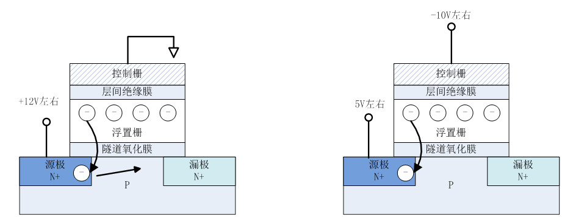

7.10 

### 记录

1. 与非：与的否定；或非：或的否定。

2. 真值表的最大项与最小项：

   

3. 组合逻辑电路：

    1. 组合逻辑电路不包含记忆原件，某一时间的输出仅取决于输入。

    2. 由与或非组合而成的组合逻辑电路可以实现任何逻辑函数。

4. 时序逻辑电路：

    1. 含有记忆元件的逻辑电路被称为时序逻辑电路。过去的电路状态也会对输出产生影响。
    2. 时序逻辑电路分为同步和异步，同步逻辑电路由时钟信号控制同步进行；异步逻辑电路不需要时钟信号。
    3. 时序逻辑电路可以描述为有限状态机，分为Mealy和Moore型逻辑电路：Mealy型逻辑电路的输出由内部状态和输入共同决定，Moore型逻辑电路仅由内部状态决定。

5. 触发器：只能存储一个bit的存储单元。

    1. D触发器是一种在电平变化时将输入信号传送至输出的边缘触发器。

6. NAND 闪存的原理：

    >闪存数据的写入和擦除是通过主板与控制栅之间电荷的输入与释放来进行的。写入时，在控制栅与漏极之间加高电压，电子通过隧道效应注入浮栅；
     
     擦除时利用F-N隧道效应放电，具体可以通过两种方法进行。一种方法是通过给源极加上+12V左右的高电压，释放浮置栅中的电荷；另一种方法是负极门擦除法，通过给控制栅-10V左右的负电压，挤出浮置栅中的电荷。
     
     读取数据的时候给控制栅加读取电压，对于浮置栅中有电荷的单元来讲，浮置栅中的电荷可抵消提供给控制栅的电压，造成阈值电压增高。与浮置栅中没有电荷时的情况相比，如果不给控制栅提供高电压，则漏极-源极之间不会处于导通的状态。因此，通过判断，通过向控制栅加读出电压，判断漏极-源极之间是否处于导通状态，可以判断浮置栅有没有存储电荷，进而判断该存储单元是“1”还是“0”。

### 疑问

1. NAND Flash 的工作原理：浮栅有无电荷如何影响读取电压？
2. LUT结构和原理不明白。
3. MUX是什么？