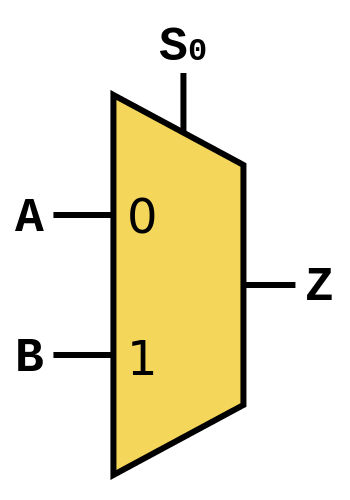
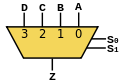

## 7.15

### 记录

1. 开关块：开关块位于横纵布线通道的交叉处，通过编程开关的通断可以控制布线路径。
   
    + 不相交型：4个方向上相同序号的连线互相连接，开关总数为 6W（每个方向上一个开关）。
    + 通用型：两个成对的开关可以在开关块内互联，当连线数为奇数时，最后一组开关采取不相交型连线。开关总数为 6W。
    + 威尔顿型：用6W个开关连接序号不同的连线，至少保证1条连线可以和序号最远的连线相连（W-1）。该拓扑结构可以形成顺时针、逆时针的闭环路径，可以用来提高 FPGA 的测试效率。
    
2. 数据选择器

    + 二选一MUX结构如下图：

      

      一个2选1数据选择器有如下的[布尔函数](https://zh.wikipedia.org/wiki/布尔函数)，$A$和$B$分别表示两个输入信号，$S$为选择信号，$Z$为输出信号，则有  $Z=(A · \overline{S})+(B · S)$ 。

      | $S$  | $A$  | $B$  | $Z$  |
      | :--: | :--: | :--: | :--: |
      |  0   |  1   |  1   |  1   |
      |  0   |  1   |  0   |  1   |
      |  0   |  0   |  1   |  0   |
      |  0   |  0   |  0   |  0   |
      |  1   |  1   |  1   |  1   |
      |  1   |  1   |  0   |  0   |
      |  1   |  0   |  1   |  1   |
      |  1   |  0   |  0   |  0   |

      在具体的电路中，实现一个这样的2选1数据选择器需要2个与门、一个或门和一个非门。其中n个输入引脚需要 $log_2(n)$ 个选择引脚。

      

3. 连接块：由可编程开关构成，用来连接布线通道和逻辑块的输入输出。

4. 三极管： 对于 NPN 三极管，当发射结正偏集电结反偏时，三极管工作在放大区。当发射结和集电结均处于正偏时，三极管工作在饱和区。

    + 硅三极管的势垒电压 Ube 约为 0.7V，大于势垒电压基极才会出现电流。饱和状态下的 Uce 约为 0.3V。
    + 主要工作在截止区和饱和区的三极管可以用作开关，通过控制基极的电流来控制开关的导通和关闭。

5. 上拉下拉电阻：

    + 上拉电阻：把一个不确定的信号通过电阻连接到高电平，使该信号初始为高电平。（[Patrick Zhang的回答 - 知乎](https://www.zhihu.com/question/23167435/answer/129511308)）

      当增加了后级系统后，将会影响到前级的截止电压，使得晶体管的集电极电压从高电平跌落到既不是高电平也不是低电平的状态。

      当T1管饱和时，上拉电阻产生的电流将灌入T1管的集电极。因此，上拉电阻对于晶体管T1来说，是灌电流负载，所以，上拉电阻的具体数值一定要考虑到前级的承受能力（发热功耗）。

    

    + 下拉电阻：把一个不确定的信号通过电阻连接到低电平，使该信号初始为低电平。（原理同上）

6. I/O 块：太难了

7. DSP块：在一定程度上同时具有可编程性和专用电路的高效性。

8. 硬宏：专用逻辑硬件电路，比如硬件乘法器和DSP。

9. PLL和DLL：PLL分频的自由度更高，但是DLL所使用的数字方式的可变延迟线比PLL所使用的VCO（压控振荡器）稳定性好。

### 疑问

1. 配置过程？