## 7.15

### 记录

1. 开关块：开关块位于横纵布线通道的交叉处，通过编程开关的通断可以控制布线路径。
   
    + 不相交型：4个方向上相同序号的连线互相连接，开关总数为 6W（每个方向上一个开关）。
    + 通用型：两个成对的开关可以在开关块内互联，当连线数为奇数时，最后一组开关采取不相交型连线。开关总数为 6W。
    + 威尔顿型：用6W个开关连接序号不同的连线，至少保证1条连线可以和序号最远的连线相连（W-1）。该拓扑结构可以形成顺时针、逆时针的闭环路径，可以用来提高 FPGA 的测试效率。
    
2. 数据选择器

    + 二选一MUX结构如下图：

      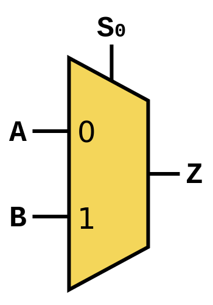

      一个2选1数据选择器有如下的布尔函数，_A_ 和_B_ 分别表示两个输入信号，_S_ 为选择信号，_Z_ 为输出信号，则有 _Z=(A · ~S)+(B · S)_ 。

      | $S$  | $A$  | $B$  | $Z$  |
      | :--: | :--: | :--: | :--: |
      |  0   |  1   |  1   |  1   |
      |  0   |  1   |  0   |  1   |
      |  0   |  0   |  1   |  0   |
      |  0   |  0   |  0   |  0   |
      |  1   |  1   |  1   |  1   |
      |  1   |  1   |  0   |  0   |
      |  1   |  0   |  1   |  1   |
      |  1   |  0   |  0   |  0   |

      在具体的电路中，实现一个这样的2选1数据选择器需要2个与门、一个或门和一个非门。其中n个输入引脚需要 _log2(n)_ 个选择引脚。

      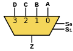

3. 连接块：由可编程开关构成，用来连接布线通道和逻辑块的输入输出。

4. 三极管： 对于 NPN 三极管，当发射结正偏集电结反偏时，三极管工作在放大区。当发射结和集电结均处于正偏时，三极管工作在饱和区。

    + 硅三极管的势垒电压 Ube 约为 0.7V，大于势垒电压基极才会出现电流。饱和状态下的 Uce 约为 0.3V。
    + 主要工作在截止区和饱和区的三极管可以用作开关，通过控制基极的电流来控制开关的导通和关闭。

5. 上拉下拉电阻：

    + 上拉电阻：把一个不确定的信号通过电阻连接到高电平，使该信号初始为高电平。（[Patrick Zhang的回答 - 知乎](https://www.zhihu.com/question/23167435/answer/129511308)）

      当增加了后级系统后，将会影响到前级的截止电压，使得晶体管的集电极电压从高电平跌落到既不是高电平也不是低电平的状态。

      当T1管饱和时，上拉电阻产生的电流将灌入T1管的集电极。因此，上拉电阻对于晶体管T1来说，是灌电流负载，所以，上拉电阻的具体数值一定要考虑到前级的承受能力（发热功耗）。

    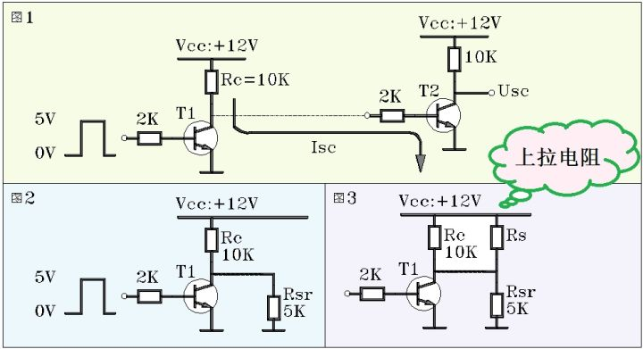

    + 下拉电阻：把一个不确定的信号通过电阻连接到低电平，使该信号初始为低电平。（原理同上）

6. I/O 块：太难了

7. DSP块：在一定程度上同时具有可编程性和专用电路的高效性。

8. 硬宏：专用逻辑硬件电路，比如硬件乘法器和DSP。

9. PLL和DLL：PLL分频的自由度更高，但是DLL所使用的数字方式的可变延迟线比PLL所使用的VCO（压控振荡器）稳定性好。

### 疑问

1. 配置过程？

## 7.16

### 记录

1. 基于HDL的设计流程
    + 逻辑综合：是指从RTL描述生成逻辑电路的过程。逻辑综合的结果是输出网表文件，且其中包括逻辑门、触发器等逻辑元素的集合以及他们的连接关系。
    
    + 技术映射：将网表所表示的逻辑映射到FPGA实际逻辑元素的过程。多数FPGA采用查找表作为可编程逻辑元素。
    
    + 布局布线（place and route）: 利用片上逻辑和布线等资源实现网表的过程。首先对逻辑元素进行布局，然后进行网络布线。 布局布线耗时很长，且布线有可能失败。
    
2. HLS设计：高层次综合或行为综合

    + 面向硬件生成的行为综合有两点约束：禁止递归、禁止动态指针。这两点是超出了数字电路概念的功能。 

    + 输入输出：一般软件函数的输入在调用时作为参数传入，输出就是在函数结束时的返回值（或以形参的形式返回）。但是硬件的模块的输入输出是一直存在的，并且需要随时可以接受或发送数据，两者的运行原理完全不同。

        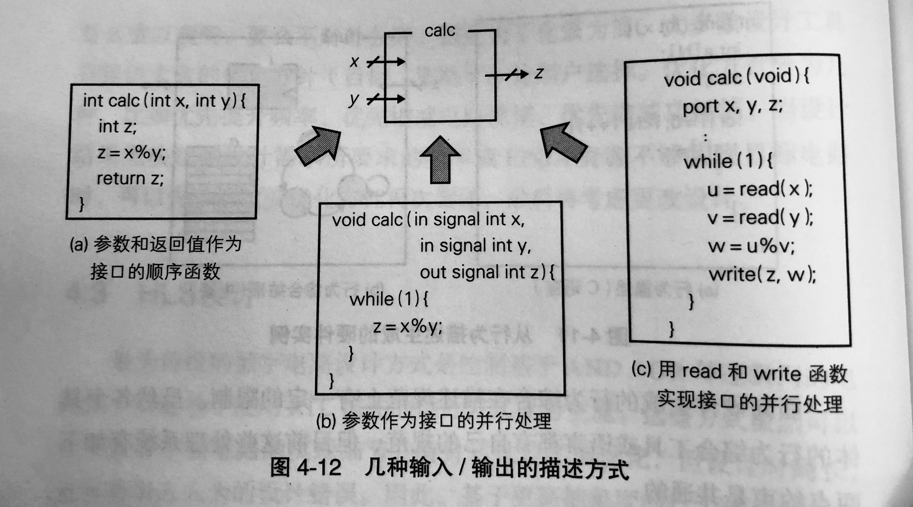

        + 参数和返回值作为接口的顺序函数：软件函数的参数为硬件模块的输入，返回值为输出。输出除了用返回值表示，还可以使用指针。

        + 参数作为接口的并行处理：硬件的摄入输出变量在任何时候都可以从函数外进行读写，当x和y发生变化时，对应的z的值也要发生变化。典型方法是使用无限循环来实现这种应激型的描述。

        + 利用read和write函数实现接口的并行处理：read输入 、write输出。
    
1. 行为综合：从基于C语言的行为级描述生成RTL级描述的过程，又称为高层次综合。
   + 在行为综合的过程中，行为记述所使用的变量、数组、运算分别使用寄存器、局部内存和运算器来实现，处理流程（如循序执行、分支、循环）则以状态机的形式来实现。
     
    + 通过分析行为描述，可以将运算的依赖关系表示为数据流图，将控制流程表示为控制流图。其中根据数据流图和控制流图来决定运行顺序和运行时刻的过程称为调度（scheduling），将变量和运算映射到寄存器或运算器的过程称为绑定（binding）。
   
1. FPGA设计流程：
   
	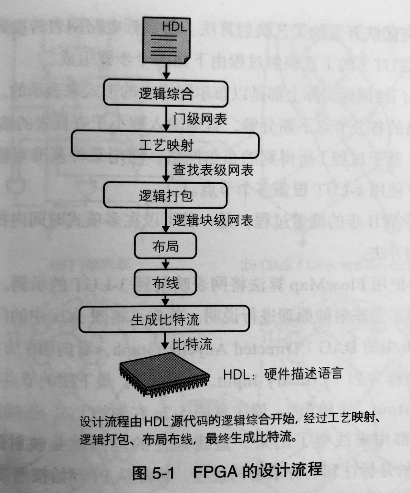

	+ 逻辑综合将HDL描述转换为门级网表，工艺映射将这个网表转换为查找表级别的网表，逻辑打包将多个查找表和触发器集合到一个逻辑块的过程；布局布线工具先决定逻辑块在器件上的位置，然后通过布线结构实现逻辑块之间的连接；最终，基于这些布局布线信息可以决定FPGA中各个开关的连接关系，以此生成比特流。
	
	+ 器件上查找表的输入数是既定的（査找表能实现输入数不大于自己的任意逻辑），而FPGA的设计就是要从目标电路的逻辑函数中不断分离出既定输入数之内的逻辑，并将其映射到查找表上。然后将这些查找表通过布线相连，就可以在FPGA上实现目标电路。
	
	+ FlowMap 工艺映射：
		
		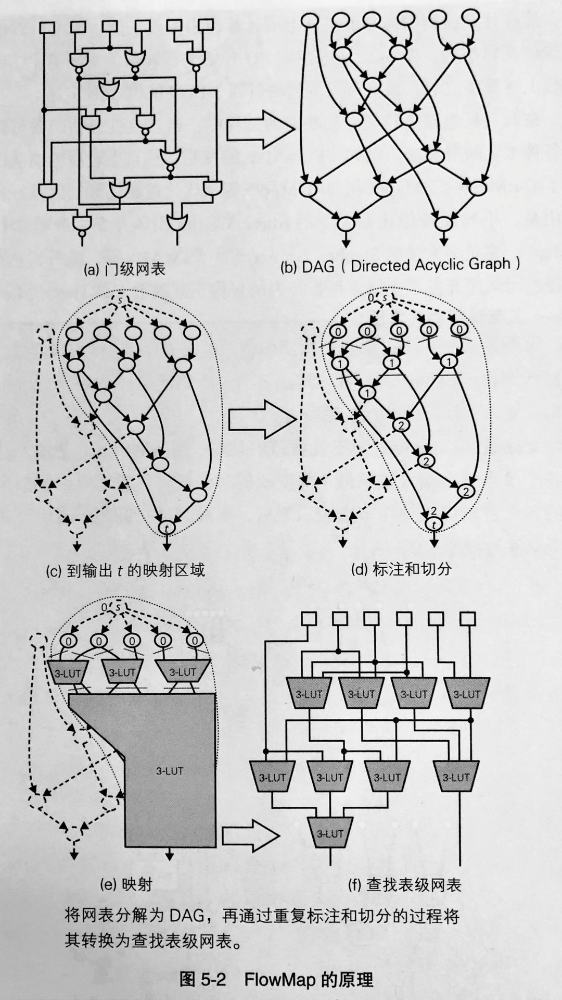
		
		标注从PI开始按照图的拓扑顺序进行，标注规则如下。
		
		(1)PI的标注标签为0。
		
		(2)在所有以PI作为输入的节点中，寻找3-LUT可以覆盖的节点，将其输入切分出来；
		
		(3)新标签为切分点上一层标签中最大的数字，再加上自身的层数（也就是1层）。例如此处为PI的0+1=1，所以标签为1。
		
		(4)顺序计算已标注节点的相邻节点。遇到还没标注的节点，先对其进行计算标注。
		
		(5)当所有相关节点的标签都计算完成后，再计算第2层节点的标签。此时还是同一个3-LUT可以覆盖的范围(可以在全部PI处切分），该节点的标签也为1。
		
		(6)如此反复计算所有节点的标签，最终t的标签为2。
		
	+ 逻辑打包：
	
		+ 逻辑块内部布线和逻辑块外部布线的延迟相差很大
	
		+ 逻辑块中有空闲的查找表，资源使用率就会降低，需要尽量的在每个逻辑块内装填更多的逻辑。
	
	+ VPack
	
		+ 两个优化目标：
			+ 最小化逻辑块的数量
			+ 最小化逻辑块间的连接数量。
		+ 将共同输入信号最多的查找表装填到当前逻辑块中。该方法无法优化延迟。
	
	+ T-VPack：选择关键路径上输入最多的查找表作为逻辑块的种子。
	
		+ 不仅考虑共同信号的影响，还考虑：连接重要度和影响路径数。
		
		+ 连接重要度由slack值计算而来。
		
			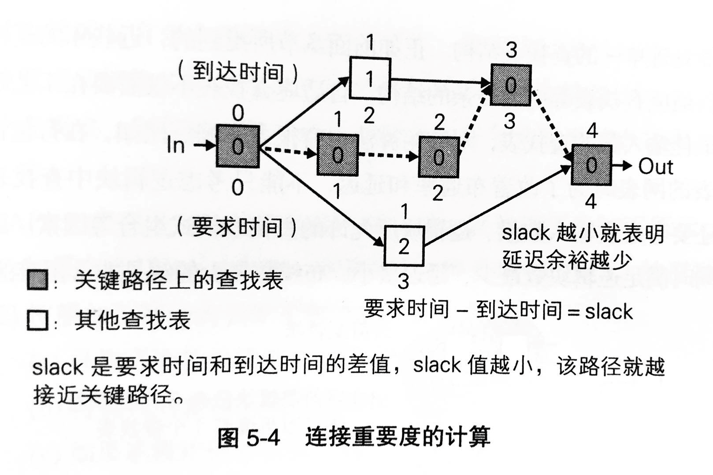
			
		+ 影响路径数：指当前查找表所影响的关键路径的数目。是输入和当前查找表之间关键路径的总和。方块内的数字表示影响路径数，可以看出查找表Y和Z之间的粗虚线是3条关键路径公用的布线，只要改善这条路径的延迟，就可以同时改善3条关键路径。因此T-VPack中的装箱算法会将Y和Z打包到同一逻辑块中。
		
			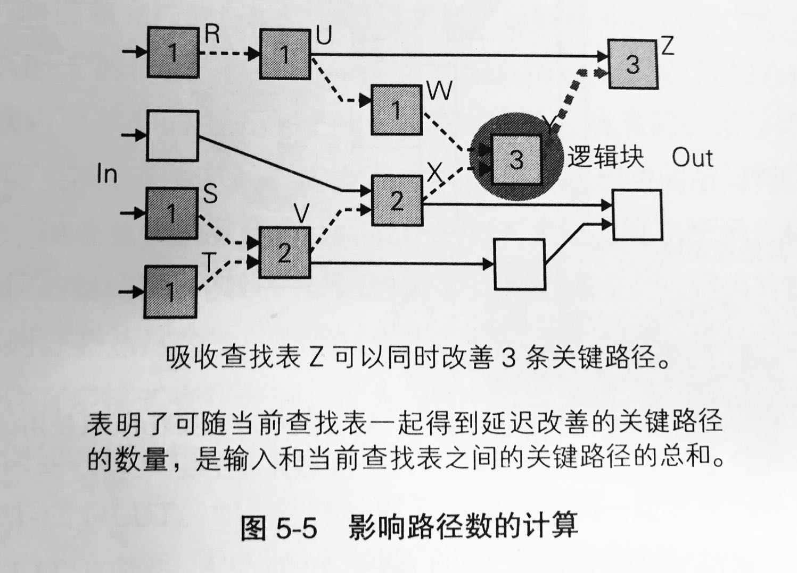
			
			
### 疑问

1. FlowMap 标注规则？工艺映射？
2. 切分集？（是指很多种切分的可能吗？）

## 7.17

### 记录

1. 可编程逻辑块的实现方法有多种，有数据选择器（MUX）和查找表（LUT）。

2. LUT：查找表是 1 个 word 只有1位的内存表，word 数取决于地址的位数。_k_ 输入的查找表由 2_k_ 个存储单元和一个 2_k_  输入的 MUX 组成。LUT 的输入就是内存表的地址信号，_k_ 输入的 LUT 可以实现 22_k_ 种逻辑函数。
	
	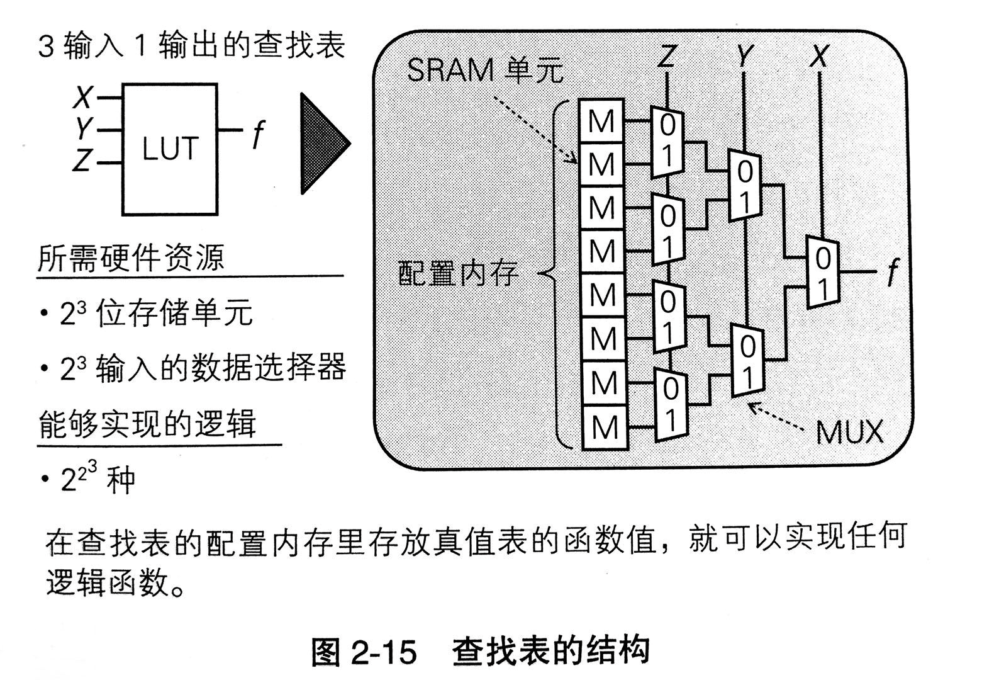
	
	+ 查找表实现多数表决电路：
	
		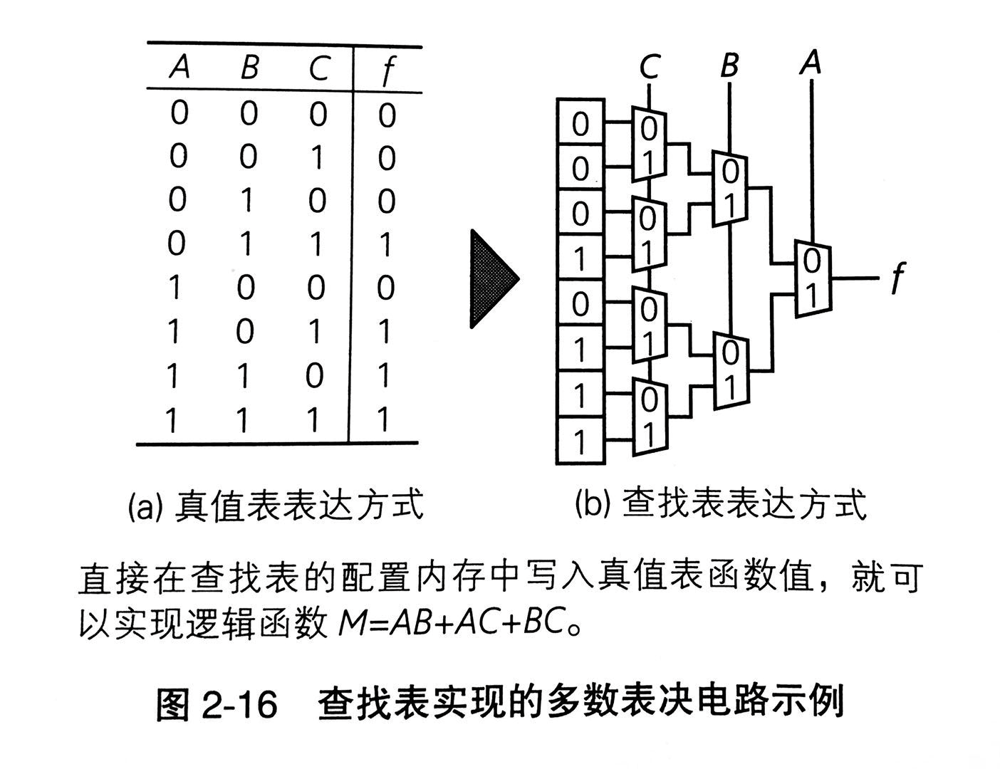
	
3. 自适应查找表：可以通过分解 LUT 实现多个逻辑，提高资源利用率。下图中的 ALE 由 2 输入的自适应查找表组成，含有两个共享全部输入的 5-LUT 组成，可以作为一个 6-LUT 或两个信号共享的 5-LUT 来使用，可以提高利用率。

	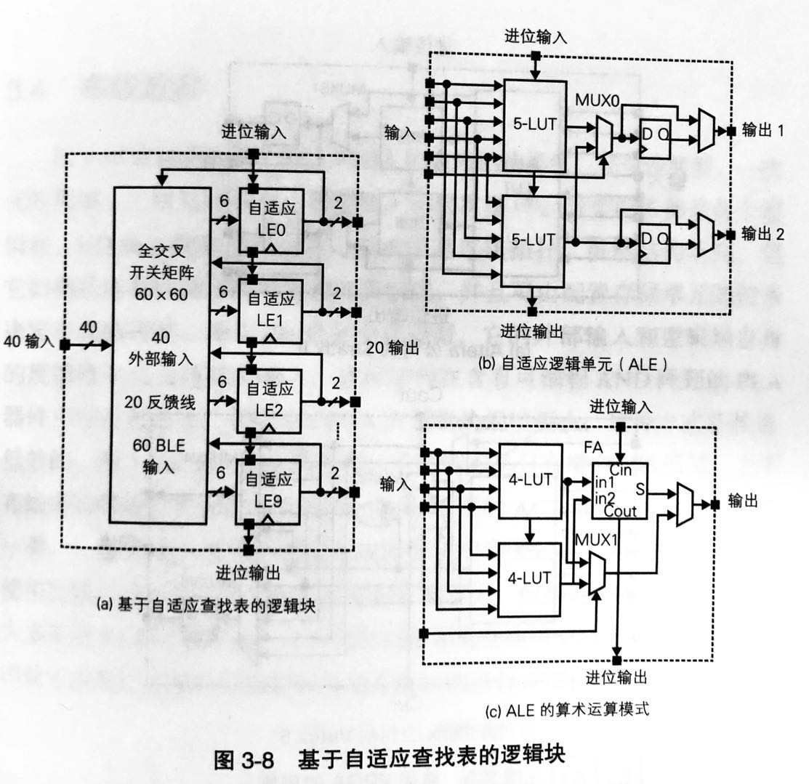

### 疑问

1.  布局布线?

