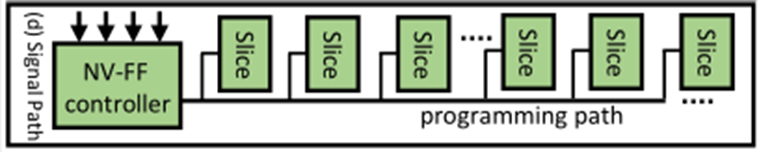

## 7.19

### 记录

1. 布线：在确定了逻辑块的位置之后，布线器就可以打通合适的可编程开关以连接电路需要的所有逻辑块的输入和输出引脚。
	+ 为了尽可能节省 FPGA 中有限的布线资源，布线的路径要尽量的短，并且布通一条线网时尽量不占用另一条线网所需要的布线资源。
	+ 对于关键路径上的线网，要使用段路径和快速布线资源进行布线，以确保速度，即使这是一条拥挤的路径。
	+ 每次拆线重布电路中的一条线网，就称为一次布线迭代。在第一次布线迭代中，每条连线均以最小延时为目标进行布线，即使会导致布线资源的拥挤或重用。重用的布线资源是无效的，需要在每次迭代之后增加重用布线资源的成本，从而提高解决拥挤问题的可能性。

### Low Overhead Online Checkpoint for Intermittently Powered Non-volatile FPGAs

### 简介

1. 能量收集系统代替电池为小型物联网设备供能，但是面临着电力不稳定和输入功率低的问题。
2. 因为 FPGA 使用的是易失性的 SRAM，所以间歇性的掉电使长期计算变得困难。可以通过使用非易失性的内存来解决，利用非易失性存储保存芯片的配置数据，避免掉电之后重新加载配置数据。
3. 现有 FPGA 的计算中间数据存储在由易失性 FF 组成的寄存器中，需要在掉电时进行保存。
4. 本文为了提高 checkpoint 的能量效率，减少断电的影响，提出了一种基于数据流的状态跟踪方法。通过状态到标志计数器的映射，FC-FPGA 可以对每个状态的中间数据进行在线跟踪。最后只有被标记过的数据被存储在非易失性存储器中，降低了检查点成本。 

### 背景

1. 前人的备份策略都很难应用在 FPGA 上，或者很难在恶劣的环境中生存。

2. 在 NV-FPGA 中使用非易失性存储器替代查找表、开关块和连接块中的 SRAM，因此在断电之后不需要重新配置数据。对于中间数据，通过在 FPGA 中集成 NV-FF 将其保存在本地芯片。

3. 高级综合：将程序分割成多个状态，并由有限状态机进行管理，该过程用控制数据流图（CDFG）表示。

4. 离线工作主要是状态到标志的映射：通过分析每个状态下的数据依赖性，生成一个类似扫描链的跟踪电路。

5. 现有的定期备份的技术，不可避免地要进行计算回滚。如果检查点离断电点很远，就会发生较大的回滚开销；如果电源较稳定，这种技术会产生许多不必要的检查点和重新计算开销。

	

### 系统结构

1. 硬件结构：包括一个有穷状态机、功能模块（function modules）、标志计数器和 NV-FF 控制器。
	
2. 有穷状态机和功能模块：

     1. FSM 生成当前的状态数，确定状态之间的数据转换。

     	

       2. 每个功能模块都包含一个预先设置的状态数，通过位同或（XNOR）动态比较当前状态数和预设置的状态数，每个功能模块都能感知其状态的活动。在断电和电源恢复时，如果 XNOR 为1时，禁用标志计数器的时钟，同时在存储或者检索模式下启用 NV-FF Controller。

     	

3. NV-FF Controller

  NV-FF 控制器保存着标志计数器和 slices 之间的物理地址映射关系。NV-FF 通过从 FSM 中提取全局状态数来识别当前活动的标志计数器以及对应的片，然后根据计数器状态和全局控制号选择要操作的片。

  

4. 标志计数器

  1. 标志计数器跟踪每个状态下的数据流，它由顺序连接的 NV-FF 组成，形成扫描链状结构。

  2. 在FPGA中，由于中间数据保存在寄存器中，每个标志计数器的触发器数量由对应状态的寄存器分布决定。

  3. 断电期间将存储相应标志值为1的寄存器，当电源恢复时，数据流就可以恢复。

  	

### FC-FPGA 离线分析

1. 状态到标志的映射：
	1. 首先将程序分割为状态，FC-FPGA为每个状态生成标志计数器，下图中的基本块 bn  表示状态 n。
	    
	
	2. 将基本块 bn 按照进度表随时间 t 展开，图中的 bnx 表示一个模块，模块中的寄存器临时保存中间数据，直至下一个模块完成。当停电时，应该存储不同的寄存器以恢复数据流，这些寄存器被定义为 **checkpoint location** ，时钟 t 的 cpl 表示为 _checkpointt_ 。
	
		
		
		下面的算法展示了如何确定 _checkpointt_  ，其中时钟周期 t 之前到达的模块和寄存器定义为 bnm 和 regnm ，否则被定义为 bni 和 regni 。然后看时钟 t 之前的寄存器和当前的模块之间是否有数据依赖关系。
		
		
		
		下图展示了上面的的基本块生成的 6 位的标志计数器。为了不失一般性，将标志寄存器首尾相连，用来完成循环操作。

		

### 问题

1. _floorplanning_ ?