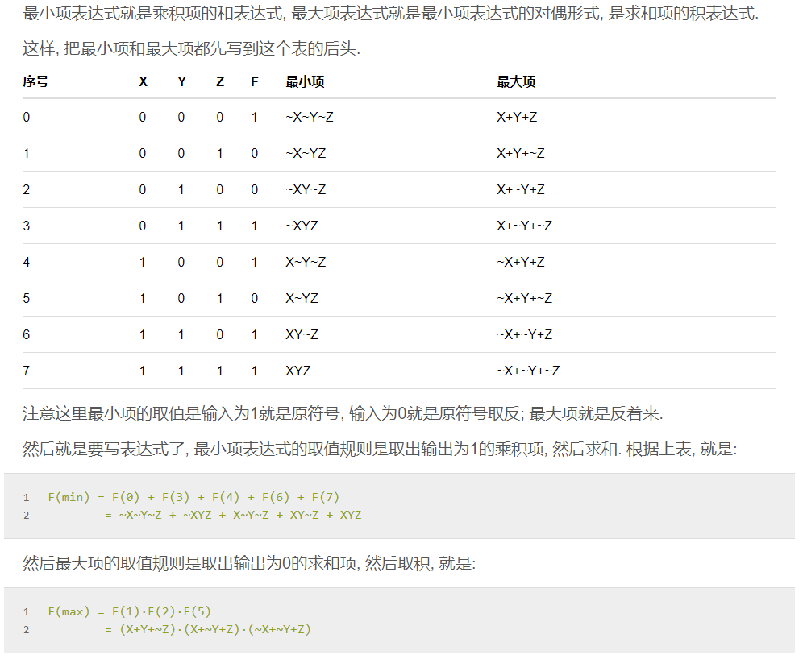
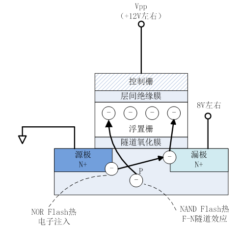
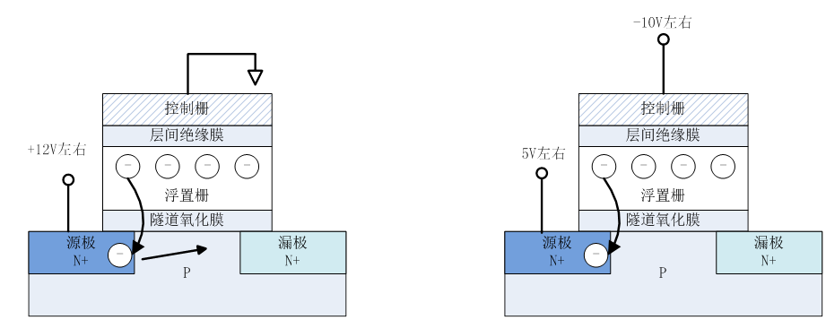
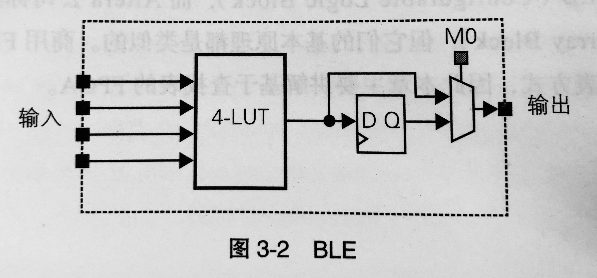

## 7.7

### 记录

1. 先用C语言写程序，之后将C语言改写成并行结构描述的C程序，保证运行结果正确之后，将关键字替换为Verilog的关键字，进入Verilog环境。
	在使用C语言替换为Verilog时可能会遇到很多问题，因为C语言是顺序结构，而Verilog是同时执行的并行结构，两者之间会有较大的冲突。
	注意Verilog的语法规则，较为死板。
	
1. 可综合的概念

1. "always"模块内的变量定义用reg型，用于时序逻辑。

    wire型变量用于组合逻辑。

### 疑问

1. 表示数字常量时的z（高阻值）表示什么？
2. reg和wire的具体区别？

## 7.8

### 记录

1. memory类型可以生成多维数组。
2. 赋值语句
   - 非阻塞赋值方式（<=）：
     赋值的变量不能立即被下面的语句使用，块结束后才能完成赋值操作。用于时序逻辑模块，变量在同一时刻被赋值，与语句次序无关。
   - 阻塞赋值方式（=）：
     赋值语句执行完后，块才结束，变量值立即改变。用于组合逻辑。
3. 块语句
   - 分为begin——end顺序快和fork——join并行块。
   - 顺序块：顺序块中的延迟是相对于前面那条语句执行完成的时间的。
   - 并行块：顺序由语句的延迟控制。延迟是相对于块语句开始执行的时刻而言。
4. initial语句和always语句，他们都是并行执行。initial语句只执行一次，而always语句在触发条件满足时是不断重复执行的。

### 疑问

1. 生成语句是用来干什么的？

## 7.10 

### 记录

1. 与非：与的否定；或非：或的否定。

2. 真值表的最大项与最小项：

   

3. 组合逻辑电路：

   1. 组合逻辑电路不包含记忆原件，某一时间的输出仅取决于输入。
   2. 由与或非组合而成的组合逻辑电路可以实现任何逻辑函数。

4. 时序逻辑电路：

   1. 含有记忆元件的逻辑电路被称为时序逻辑电路。过去的电路状态也会对输出产生影响。
   2. 时序逻辑电路分为同步和异步，同步逻辑电路由时钟信号控制同步进行；异步逻辑电路不需要时钟信号。
   3. 时序逻辑电路可以描述为有限状态机，分为Mealy和Moore型逻辑电路：Mealy型逻辑电路的输出由内部状态和输入共同决定，Moore型逻辑电路仅由内部状态决定。

5. 触发器：只能存储一个bit的存储单元。

   1. D触发器是一种在电平变化时将输入信号传送至输出的边缘触发器。

6. NAND 闪存的原理：

   > 闪存数据的写入和擦除是通过主板与控制栅之间电荷的输入与释放来进行的。写入时，在控制栅与漏极之间加高电压，电子通过隧道效应注入浮栅；
   >  
   >  擦除时利用F-N隧道效应放电，具体可以通过两种方法进行。一种方法是通过给源极加上+12V左右的高电压，释放浮置栅中的电荷；另一种方法是负极门擦除法，通过给控制栅-10V左右的负电压，挤出浮置栅中的电荷。
   >  
   >  读取数据的时候给控制栅加读取电压，对于浮置栅中有电荷的单元来讲，浮置栅中的电荷可抵消提供给控制栅的电压，造成阈值电压增高。与浮置栅中没有电荷时的情况相比，如果不给控制栅提供高电压，则漏极-源极之间不会处于导通的状态。因此，通过判断，通过向控制栅加读出电压，判断漏极-源极之间是否处于导通状态，可以判断浮置栅有没有存储电荷，进而判断该存储单元是“1”还是“0”。

### 疑问

1. NAND Flash 的工作原理：浮栅有无电荷如何影响读取电压？
2. LUT结构和原理不明白。
3. MUX是什么？

## 7.11 

### 记录

1. BLE由实现组合电路的查找表、实现时序电路的触发器以及数据选择器组成。

   

   数据选择器在存储单元M0的控制下决定直接输出查找表的值还是输出FF中存储的值。

2. 自适应查找表：

3. 岛型和层次型布线

   1. 层次型布线：布线分为多个层次，一般层次越高，连线的数量越多。层次布线的优点是同层次内的连接所需的开关数量少，因此信号传输速度快。但是各层间有着明确的分界线，跨层连接会导致延迟增加。
   2. 岛型布线：逻辑块成阵列状布置，逻辑块之间具有横向和纵向布线通道

4. 由连接块和开关块组成的布线要素对FPGA面积和电路延迟的影响很大，布线延迟比逻辑延迟占比更大。需要权衡布线自由度和性能：提高自由度需要增加开关数量，面积和延迟会恶化；如果减少开关数量，布线所占资源会减少，但是可能会因为资源不足而导致布线失败。

5. 很难找到最理想的布线方案，还需要中长距离的布线。双向连线虽然可以减少布线通道中连线的数量，但总有一个方向的开关会闲置，还会增加连线电容影响延迟。单向连线虽然布线数量是双向来你先的两倍，但开关不会闲置而且连线电容较小。

6. 开关块位于横纵布线交叉处，可以通过可编程开关来控制布线路径。

   1. 不相交型开关块拓扑：相同序号的连线相互连接，结构简单，自由度较低。开关总数为6W个。
   2. 通用型：同样是6W个开关。

### 疑问

1. 自适应查找表的结构？

